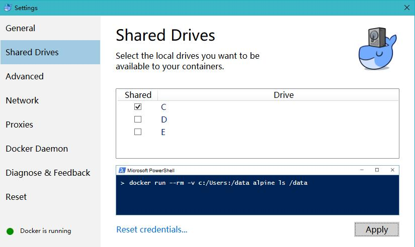

# Docker + Nginx + MySql + PHP 开发环境

## 目录结构

    ├── data 容器数据文件夹
    │   ├── mysql 数据库文件
    │   ├── redis 数据库文件
    │   └── ... 更多服务容器数据文件
    ├── log 日志文件夹 
    │   ├── mysql 日志文件
    │   ├── redis 日志文件
    │   ├── nginx 日志文件
    │   ├── php   日志文件
    │   └── ... 更多服务容器日志文件
    ├── sercie 服务文件夹
    │   ├── mysql 服务
    │   │   └── conf 配置文件
    │   ├── redis 服务
    │   │   └── conf 配置文件
    │   ├── php 服务
    │   │   ├—— php7.2
    │   │   └── ... 更多php版本
    │   ├── nginx 服务
    │   │   ├── conf 配置文件
    │   │   └───── conf.d 虚拟机配置文件 
    │   └── ... 更多服务容器日志文件
    ├── wwwroot 项目目录
    │   ├── site1
    │   ├── site2
    │   └── ... 更多项目
    ├── docker-compose.yml 服务自动化部署

## 使用方法


#### 保证宿主机以下端口未被占用：
  
  1. mysql: 3306
  2. php-fpm: 9000
  3. nginx: 80 & 443
  4. redis: 6379
  5. memcached: 11211
  6. docker: 5000


#### 将测试域名 `www.site1.com` `site2.com` `www.site2.com` 配置到系统的hosts文件中

#### 操作时切换为 root 用户

#### docker-composer.yml 中的相关信息需要根据自己的实际需要进行调整，如：

    - docker-compose 的 version 改为 2 如果 3 不行的话
    - mysql、nginx、redis、memcached等的端口号调整

#### 安装好 docker 和 docker-compose 

#### 启动： 在 dnmp/ 目录执行 `docker-compose up -d` 即可

#### 关闭： 在 dnmp/ 目录执行 `docker-compose down` 即可

#### 切换php版本

默认使用的配置是“docker-compose.yml”，此配置启动的是php7.2版本。如果需要php5.6，可以使用以下命令：

```bash
docker-compose -f docker-compose-php5.6.yml build 
docker-compose -f docker-compose-php5.6.yml up -d
```
切换回7.2：
```bash
docker-compose -f docker-compose.yml build 
docker-compose -f docker-compose.yml up -d
```

## windows注意事项


#### “以管理员身份”启动 cmd 命令行

#### 设置 docker 和 windows 共享 C 盘

如果没有设置共享，mysql和redis容器会启动失败。



## [常用 Docker 命令](./docker-learn.md)